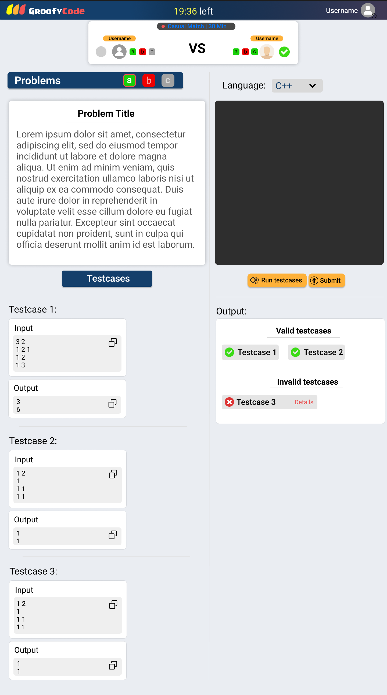
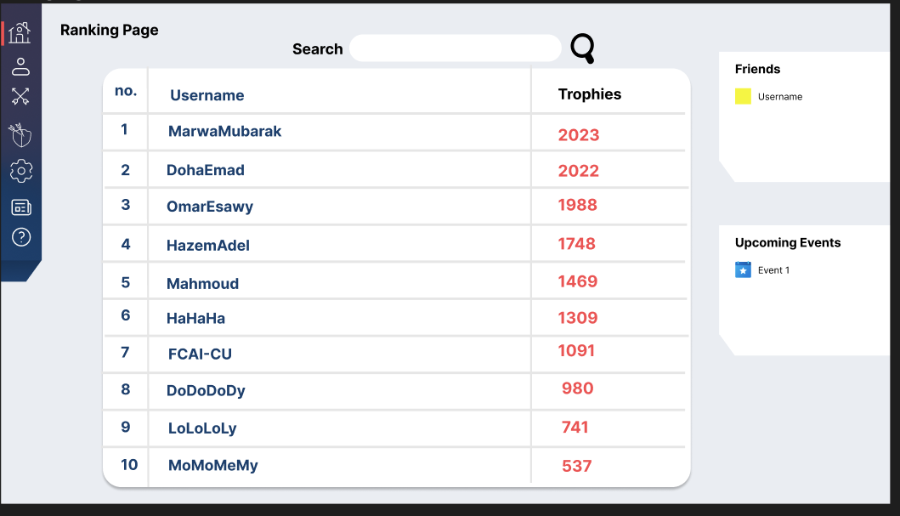

# Groofy Code
Groofy Code is an online platform that aims to bring together coding enthusiasts to participate in coding challenges, solve problems, and compete in 1 vs 1 matches. The platform will have a comprehensive user system, a challenge mechanism, a rating system, clan features, and an interactive chat system. It will be developed using React for the frontend, Express.js for the backend, and incorporate machine learning for various functionalities.

# To build the project

# Frontend Designs

    
Login Page

  

    
Home Page

  

    
Clan Chat

  

    
Match Page

  

    
Ranking Page

  

# Database Schema

# Terminologies

# Classes

# FAQ

# Contributers
1. Hazem Adel
2. Omar Esawy
3. Mahmoud Abdelrady
4. Doha Emad
5. Marwa Mubarak
